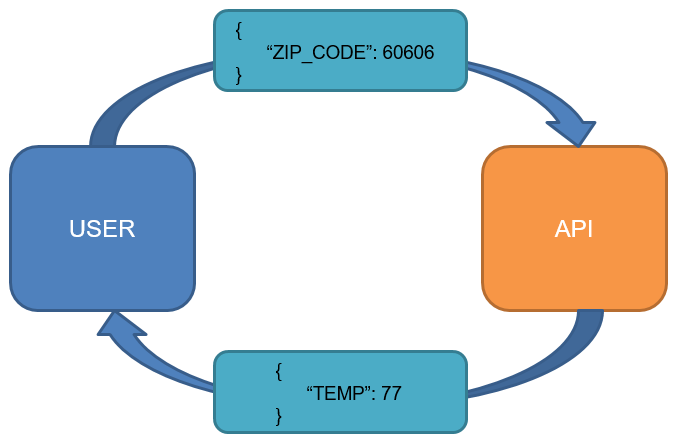
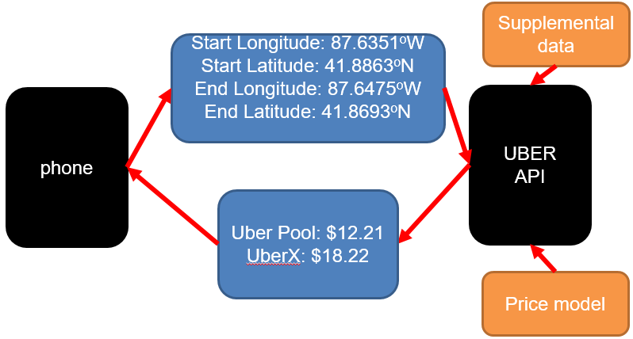
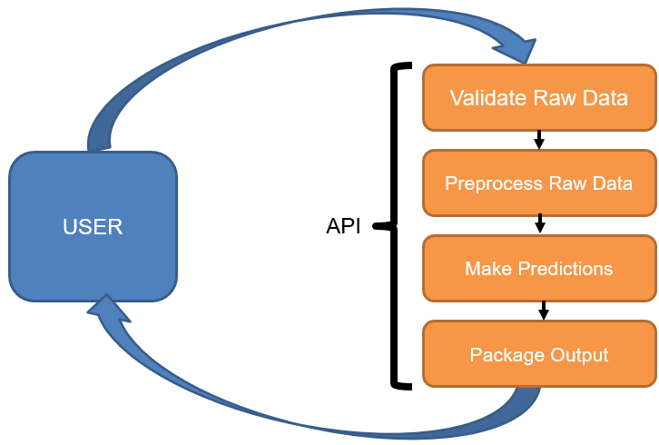

```{r setup, include=FALSE}
knitr::opts_chunk$set(echo = FALSE)
```

## Goals for Today

- Learn what an API (RESTful) is
- Learn the role of APIs in Data Science
- Learn how to deliver a machine learning product as an API

## What is a RESTful API

- Key word is "stateless"
- API is a means of communication between *server* and *client*
- No information is retained by the API
- A response from the API shall not change for a fixed input

## Simple Weather API



## Simple Weather API

Why is this so powerful?

- Determination of temperature does not have to happen locally
- Service doesn't need to know who needs what information
- User can ask API for temperature as often as they would like

## Applications in Data Science

How can we use this framework to *deliver* a machine learning product?

- Machine learning model can live within the API
- User could send new observations, API could return predictions
- Could be built into a "back end"

Major advantages?

- Communication for the user is fixed (standard input)
- Can expect a standard output
- User doesn't need:
    - The model itself
    - To do heavy computations (cpu, gpu, memory, etc..)

## Real World Example: Uber



# Simple ML API Workflow

## Simple Modular Workflow



## Simple Modular Workflow

- Validate raw data
    - Ensure data sent into API is identical as raw data available to train model
- Preprocess raw data
    - Perform **identical** preprocessing as done before model training
- Make predictions
    - Using model predict function
- Package output
    - Add supplemental data and package into **JSON** (common choice) format

## Validate Raw Data

```r
ConfirmRawDataIsValid = function(df) {
  if (df == 'valid') {
    return(TRUE)
  } else {
    return(FALSE)
  }
}
```

- Confirm required metadata is given (Client ID, Hospital ID, etc..)
- Confirm required features are given (and NO extra features)
- Confirm feature classes are correct (string, int, logical, etc..)
- Confirm data restrictions are met (Age > 0, Charges Sum to 100%, etc..)


## Preprocess Raw Data

```r
PreprocessDF = function(df) {
  df = DoSomethingToDo(df)
  df = DoSomethingElseToDo(df)
  df = HellLetsDoOneMoreThing(df)

  return(df)
}
```

- **MUST BE IDENTICAL** to preprocessing done before model training
- Motivation for modular code design
- Returns *data.frame* ready for predict()

## Make Predictions

```r
MODEL = readRDS('model_path/model.rds')

MakePredictions = function(df) {
  preds = predict(MODEL, data=df)

  return(preds)
}
```

- Essentially just a wrapper over our predict function
- Model should be in global environment so it is not loaded for each call

## Package Output

```r
PackageOutput = function(preds, clientId, batchName) {
  output = list(
    batch = batchID,
    client = clientID,
    data = list(
      ...
    )
  )

  return(output)
}
```

- Nested lists lend themselves well to JSON
- *data* would be formatted for each observation and is API dependent

# Advanced Topics

## Why Environment Control?

...

## Why Environment Control?

- Freezes environment
    - R packages
    - R package versions
    - OS utilities
    - Immune to API host upgrades
- Easy to replicate API on different host
- Easy to test API
- Easy to *scale* API (increased traffic)

## API I/O

Inputs

- JSON (posted to API url)
- Format is predetermined (and strictly enforced)
- [OpenAPI](https://swagger.io/specification/) common guideline
- Authentication, security, encryption
    - Certificates

Outputs

- JSON
- Format is predetermined
- [Status Codes](https://www.w3.org/Protocols/rfc2616/rfc2616-sec10.html)

## Status Codes

- 100-199 (Informational)
- 200-299 (Success)
    - ex: 200 (OK)
    - ex: 201 (Created)
    - ex: 202 (Accepted)
- 300-399 (Redirection)
- 400-499 (Client Error)
    - ex: 400 (Bad Request)
    - ex: 404 (Not Found)
- 500-599 (Server Error)
    - ex: 500 (Internal Server Error)

## Requests

cURL

- Header sent first (information, certificates, etc..)
- Body sends data (if applicable)

GET

- Ask server for something
    - ex: uic.edu returns home page

POST

- Ask server to take something (and maybe return)
    - ex: uber api takes coordinates and returns fares

# API Example (R package plumber)
