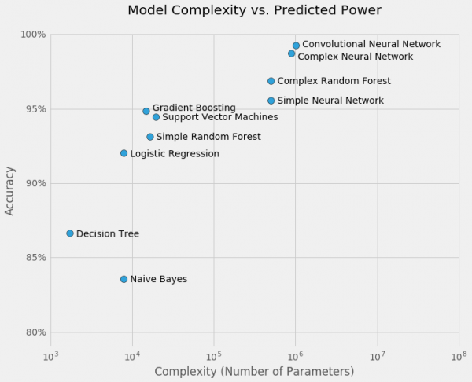

```{r setup, include=FALSE}
knitr::opts_chunk$set(echo = FALSE)
```

## Goals for Today

- Talk about importance of model interpretability
    - Explore some interpretability techniques in R
- Talk about ethics in data science / machine learning
- Talk about job prep
    - Resume
    - Phone screening
    - In-person

# Model Interpretability

## Model Interpretability

- Where did this prediction come from?
- Why did the model make this prediction?
- What features are the most important?

## Model Selection

If interpretability is important to the stakeholder, how does this affect model selection?

Which models lend themselves well?

Which models are hard to interpret?

How much more valuable is accuracy over interpretability?

## Model Selection



## Supplemental Data

- Feature Importance (model level)
    - Linear models?
    - Trees?
    - Neural Networks?
- Similarity Scores
- Prediction Indicators (prediction level)

## Feature Importance

- Linear models
    - Feature selection
    - p-value
- Tree models
    - Random Forrest
    - Boosted Trees
- Neural Networks
    - Can we easily calculate?
    - [Google NN Article](https://ai.googleblog.com/2018/03/the-building-blocks-of-interpretability.html)

## Similarity Scores

- Distance
    - Euclidean
    - Manhattan
- Cosine Similarity
- Remember to:
    - Scale
    - Reduce dimensions (computations)

## Prediction Indicators

Some models allow you to show what "lead" to a prediction

- Scaled logistic regression
    - Look at weights
- Tree models
    - Follow prediction down each tree (what about if boosted?)
    - Look at prediction per tree
- Neural Nets?
    - Still open research topic
    - Some potential in looking at weights/biases

# Ethics

## Crowe Case Study

Client: Healthcare

Issue: Model making prediction that is *illegal*

How?

Why?

What did we do?

## Another Example

Project: ranking resumes

Issue: What information can we predict on?

## Ethics in ML

Have to be very careful what personal information you train on:

- Race
- Location (zip code, area code, college, etc..)
- Gender
- Age
- What else?

## Ethics in ML

Data security

- PHI
- HIPAA
- Financial information
- SOC 2
- [T-Mobile](https://arstechnica.com/information-technology/2017/10/t-mobile-website-bug-apparently-exploited-to-mine-sensitive-account-data/)

Personal Information

- Who owns the data?
- Data we collect, what can we use it for?
- What would Facebook do?

# Job Prep

# Disclaimer: This is based on my Personal Experiences

## Resume

- Focus on ML/DS project experience (work preferred)
- List languages used, models used, etc..
- Talk about involvement in those projects
    - Project planning
    - EDA, ETL, etc..
    - Model development
    - Delivery
    - Impact
    - Feedback

## Phone Screens

- **Enthusiasm, Passion, Enjoyment, Interest in DS/ML**
- Research the team!
    - Know their projects
    - Know their clients
    - Know their competitors
    - Ask about team environment, day-to-day, solo vs. team
- Explain your previous projects
    - Be honest about *your* involvement
    - Emphasis on entire project life cycle
    - Explain what you learned and what you would of done differently


## Phone Screens

- Understand and communicate role of a data scientist at a company
- Know fundamental difference between different models
    - Explain why certain model is preferred in certain situation
    - Know the details
- Practicality!
    - Simple solutions go a **LONG** way
- Be humble!  If you do not know something do not pretend, be passionate about learning it.

## In-Person

- **Enthusiasm, Passion, Enjoyment, Interest in DS/ML**
- Be prepared
- Dress up
- Generally speaking the things you need to prove in-person are:
    - You can do the job
    - You know ML below the surface (know the details!)
    - You can learn new things (and are open to it)
    - You are someone we want to work with

# Best of Luck!
